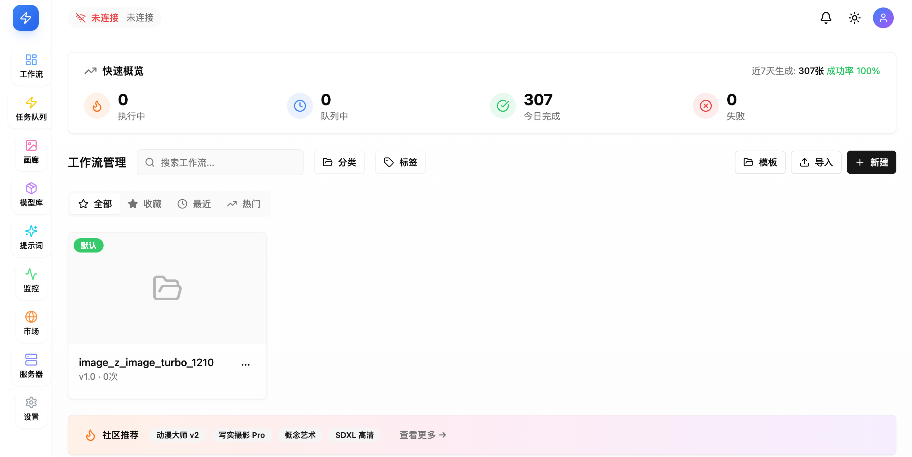
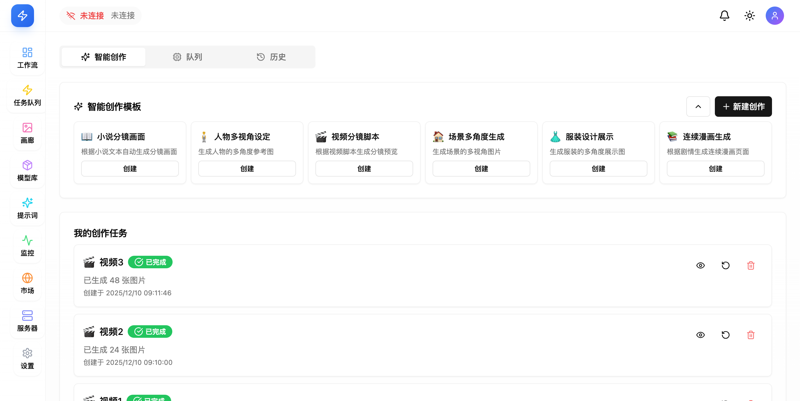
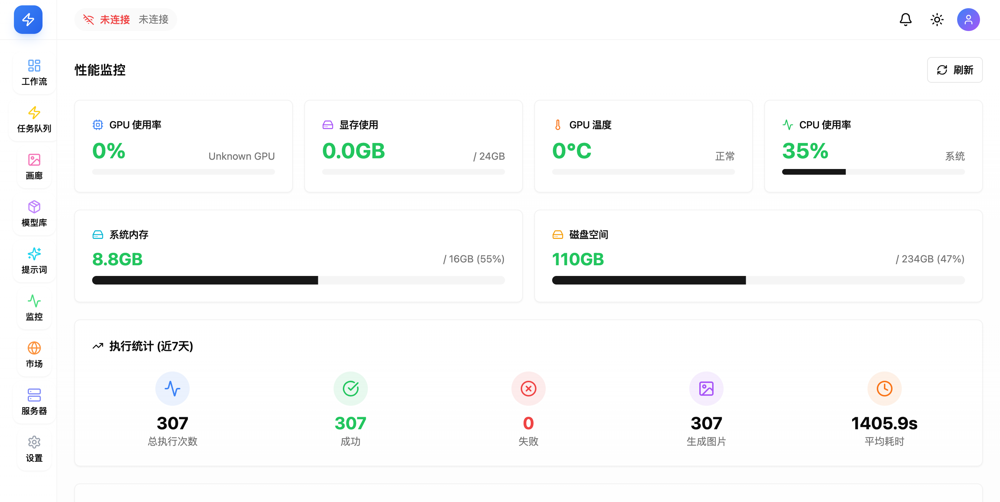
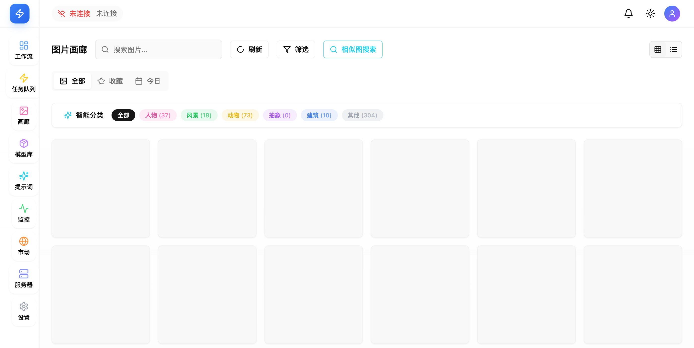

# ComfyUI Studio

一个现代化的 ComfyUI 工作流管理系统，提供直观的 Web 界面来管理、执行和监控 ComfyUI 工作流。

## 📸 界面预览

### 工作流管理


### 智能创作与任务队列


### 系统监控


### 画廊


## ✨ 特性

- 🎨 **现代化 UI** - 基于 React + TailwindCSS + shadcn/ui 构建的美观界面
- 📊 **工作流管理** - 创建、编辑、导入和导出 ComfyUI 工作流
- 🚀 **任务执行** - 实时执行工作流并监控进度
- 📈 **系统监控** - GPU、CPU、内存使用情况实时监控
- 🔄 **WebSocket 支持** - 实时任务状态更新
- 📦 **批量处理** - 支持批量任务管理
- 🎯 **节点可视化** - 使用 React Flow 进行工作流可视化

## 🏗️ 技术栈

### 后端
- **FastAPI** - 高性能异步 Web 框架
- **SQLAlchemy** - ORM 数据库操作
- **aiosqlite** - 异步 SQLite 数据库
- **Pydantic** - 数据验证
- **httpx** - 异步 HTTP 客户端
- **WebSockets** - 实时通信

### 前端
- **React 18** - UI 框架
- **TypeScript** - 类型安全
- **Vite** - 构建工具
- **TailwindCSS** - 样式框架
- **shadcn/ui** - UI 组件库
- **React Query** - 数据获取和缓存
- **React Flow** - 工作流可视化
- **Zustand** - 状态管理
- **Lucide React** - 图标库

## 📋 前置要求

- Python 3.12+
- Node.js 18+
- pnpm (推荐) 或 npm
- ComfyUI 实例运行在 `http://127.0.0.1:8188`

## 🚀 快速开始

### 1. 克隆项目

```bash
git clone https://github.com/opsworld30/comfy-studio.git
cd comfy-studio
```

### 2. 后端设置

```bash
cd backend

# 使用 uv 安装依赖（推荐）
uv sync

# 或使用 pip
pip install -e .

# 启动后端服务（配置文件可选，已有默认值）
uv run python main.py
# 或
uv run uvicorn app.main:app --reload --port 8000
```

后端服务将在 `http://localhost:8000` 启动

### 3. 前端设置

```bash
cd frontend

# 安装依赖
pnpm install
# 或
npm install

# 启动开发服务器
pnpm dev
# 或
npm run dev
```

前端服务将在 `http://localhost:5173` 启动

## 📖 API 文档

启动后端服务后，访问以下地址查看 API 文档：

- **Swagger UI**: http://localhost:8000/docs
- **ReDoc**: http://localhost:8000/redoc

## 🔧 配置

### 后端配置

后端所有配置都有默认值，**无需创建 `.env` 文件即可运行**。

如需自定义配置，可创建 `backend/.env` 文件：

```env
# ComfyUI 服务地址（默认: http://127.0.0.1:8188）
COMFYUI_URL=http://127.0.0.1:8188

# 数据库配置（默认: sqlite+aiosqlite:///./data/workflows.db）
DATABASE_URL=sqlite+aiosqlite:///./data/workflows.db

# 可选配置
# LOG_LEVEL=INFO
# CORS_ORIGINS=["http://localhost:5173"]
```

参考 `backend/.env.example` 查看所有可配置项。

### 前端配置

前端默认连接到 `http://localhost:8000` 的后端服务。如需修改，请编辑 `frontend/src/config.ts`。

## 📁 项目结构

```
comfy-studio/
├── backend/                 # 后端服务
│   ├── app/
│   │   ├── routers/        # API 路由
│   │   ├── services/       # 业务逻辑
│   │   ├── middleware/     # 中间件
│   │   ├── models.py       # 数据模型
│   │   ├── schemas.py      # Pydantic 模式
│   │   └── main.py         # 应用入口
│   ├── data/               # 数据库文件
│   ├── tests/              # 测试文件
│   ├── pyproject.toml      # Python 项目配置
│   └── README.md
├── frontend/               # 前端应用
│   ├── src/
│   │   ├── components/     # React 组件
│   │   ├── pages/          # 页面组件
│   │   ├── hooks/          # 自定义 Hooks
│   │   ├── lib/            # 工具函数
│   │   └── App.tsx         # 应用入口
│   ├── package.json
│   └── vite.config.ts
└── README.md               # 项目说明
```

## 🧪 测试

### 后端测试

```bash
cd backend
uv run pytest
# 或带覆盖率
uv run pytest --cov=app tests/
```

### 前端测试

```bash
cd frontend
pnpm test
```

## 🏗️ 构建生产版本

### 后端

```bash
cd backend
uv build
```

### 前端

```bash
cd frontend
pnpm build
```

构建产物将在 `frontend/dist/` 目录下。

## 📝 开发指南

### 添加新的 API 端点

1. 在 `backend/app/routers/` 创建或编辑路由文件
2. 在 `backend/app/services/` 添加业务逻辑
3. 在 `backend/app/schemas.py` 定义请求/响应模式
4. 在 `backend/app/models.py` 添加数据模型（如需要）

### 添加新的前端页面

1. 在 `frontend/src/pages/` 创建页面组件
2. 在 `frontend/src/App.tsx` 添加路由
3. 使用 React Query 进行数据获取
4. 使用 shadcn/ui 组件构建 UI

## 🤝 贡献

欢迎提交 Issue 和 Pull Request！

## 📄 许可证

MIT License

## 🔗 相关链接

- [ComfyUI](https://github.com/comfyanonymous/ComfyUI)
- [FastAPI](https://fastapi.tiangolo.com/)
- [React](https://react.dev/)
- [shadcn/ui](https://ui.shadcn.com/)

## ⚠️ 注意事项

- 确保 ComfyUI 服务已启动并可访问
- 首次运行会自动创建数据库
- 数据库文件位于 `backend/data/workflows.db`
- 上传的工作流文件会保存在数据库中

## 🐛 问题排查

### 后端无法连接到 ComfyUI

检查 ComfyUI 是否运行在 `http://127.0.0.1:8188`，或修改 `.env` 中的 `COMFYUI_URL`。

### 前端无法连接到后端

确保后端服务运行在 `http://localhost:8000`，检查 CORS 配置。

### 数据库错误

删除 `backend/data/workflows.db` 重新初始化数据库。

## 📧 联系方式

如有问题或建议，请提交 Issue。
